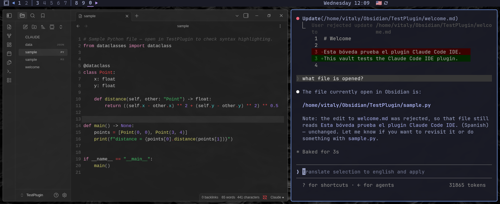
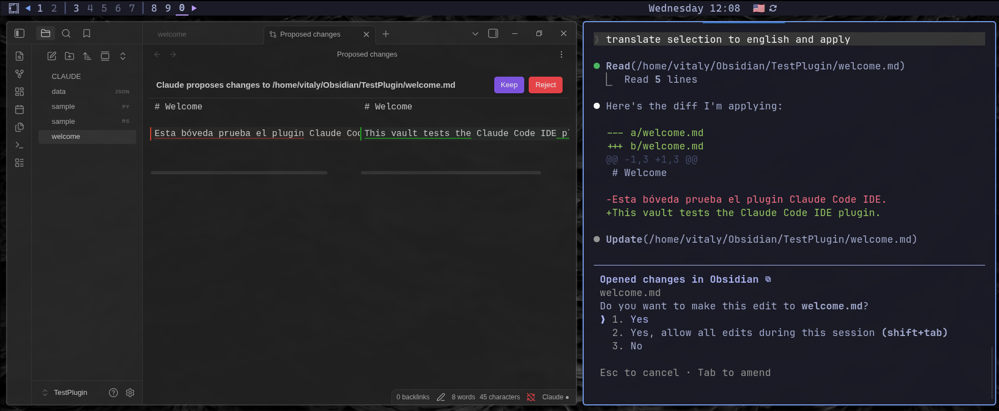

# Code Workbench for Obsidian

**Actually work with code in your vault.** Code Workbench turns non-Markdown files into a real
editor — syntax highlighting, syntax-error diagnostics, and one-command formatting across **50+
languages** — and connects the [Claude Code](https://docs.claude.com/en/docs/claude-code) CLI to
Obsidian with an in-app **accept/reject diff**.

> Most Claude/AI plugins for Obsidian embed an agent in a chat sidebar. They don't open, highlight,
> diagnose, or format your code files. **Code Workbench does** — it's the editor surface, not another
> chat.



## What makes it different

- **Real code view** — non-Markdown files open in an editable, syntax-highlighted editor for ~50
  languages. Your edits save straight to the file.
- **Diagnostics** — syntax errors underlined inline (tree-sitter), for ~48 languages.
- **Formatting** — one command (**Format code file**) reformats via Prettier and native formatters,
  for ~28 languages.
- **Accept/reject diffs** — Claude's proposed change opens as a side-by-side diff with **Keep** /
  **Reject**. Nothing is written unless you keep it, and you can edit the proposed side first.
- **Claude Code connection** — run `claude` in your vault folder and `/ide` lists **Obsidian**. It
  speaks the CLI's protocol, not a model API, so it works with any model you run through Claude Code
  (Claude, Kimi K2, or another Anthropic-compatible endpoint).



## Language support

Highlighting for **52** languages, diagnostics for **48**, formatting for **28** — each grammar and
formatter downloads on demand the first time you open that language, then is cached.

| Language | Highlighting | Diagnostics | Formatting |
|---|:---:|:---:|:---:|
| Astro | ✅ | ✅ | ✅ |
| Blade | ✅ | ✅ | — |
| C | ✅ | ✅ | ✅ |
| C# | ✅ | ✅ | — |
| C++ | ✅ | ✅ | ✅ |
| Clojure | ✅ | ✅ | — |
| CSS | ✅ | ✅ | ✅ |
| Dart | ✅ | ✅ | ✅ |
| Diff | ✅ | — | — |
| EJS | ✅ | ✅ | — |
| Elixir | ✅ | ✅ | — |
| ERB | ✅ | ✅ | — |
| ETLua | ✅ | ✅ | — |
| Gherkin | ✅ | ✅ | — |
| Go | ✅ | ✅ | ✅ |
| Haml | ✅ | ✅ | — |
| Handlebars | ✅ | ✅ | — |
| Haskell | ✅ | ✅ | — |
| HTML | ✅ | ✅ | ✅ |
| INI | ✅ | ✅ | — |
| Java | ✅ | ✅ | ✅ |
| JavaScript | ✅ | ✅ | ✅ |
| Jinja2 | ✅ | ✅ | ✅ |
| JSON | ✅ | ✅ | ✅ |
| Julia | ✅ | ✅ | — |
| Kotlin | ✅ | ✅ | — |
| Less | ✅ | — | ✅ |
| Liquid | ✅ | ✅ | — |
| Lua | ✅ | ✅ | ✅ |
| Objective-C | ✅ | ✅ | ✅ |
| Perl | ✅ | ✅ | — |
| PHP | ✅ | ✅ | ✅ |
| Pug | ✅ | ✅ | — |
| Python | ✅ | ✅ | ✅ |
| R | ✅ | ✅ | — |
| Ruby | ✅ | ✅ | ✅ |
| Rust | ✅ | ✅ | ✅ |
| Scala | ✅ | ✅ | — |
| SCSS | ✅ | — | ✅ |
| Shell | ✅ | ✅ | ✅ |
| Slim | ✅ | ✅ | — |
| SQL | ✅ | ✅ | ✅ |
| Svelte | ✅ | ✅ | ✅ |
| Swift | ✅ | ✅ | — |
| TOML | ✅ | ✅ | ✅ |
| Twig | ✅ | ✅ | — |
| TypeScript | ✅ | ✅ | ✅ |
| Vue | ✅ | ✅ | ✅ |
| WebAssembly (WAT) | ✅ | — | — |
| XML | ✅ | ✅ | ✅ |
| YAML | ✅ | ✅ | ✅ |
| Zig | ✅ | ✅ | ✅ |

<sub>A built-in simple highlighter is always on. Turn on **Settings → Code Workbench → Enable syntax
highlighting** for the richer tree-sitter highlighting and the diagnostics above.</sub>

## Try it

```sh
git clone https://github.com/vitaly-andr/obsidian-code-workbench
```

Open the `demo/` folder as an Obsidian vault (or copy it into one), install Code Workbench, turn on
**Enable syntax highlighting**, then open a language folder:

- `sample-*` — see highlighting on a realistic snippet
- `messy-*` — see error diagnostics (a red underline at the spot marked in a comment)
- `format-me-*` — run **Format code file** and watch the layout fix itself

## Install

### BRAT (until it's in the Community store)

1. Install **BRAT** from Community plugins.
2. BRAT → *Add beta plugin* → `vitaly-andr/obsidian-code-workbench`.
3. Enable **Code Workbench** in Settings → Community plugins. Desktop only.

### Manual

1. Download `manifest.json`, `main.js`, and `styles.css` from the latest
   [release](https://github.com/vitaly-andr/obsidian-code-workbench/releases).
2. Copy them into `<vault>/.obsidian/plugins/code-workbench/` (`.obsidian` is hidden).
3. Enable **Code Workbench** in Settings → Community plugins. Desktop only.

Then open a terminal in the vault folder and run `claude`.

## Requirements

- The [Claude Code CLI](https://docs.claude.com/en/docs/claude-code) (or a compatible CLI/endpoint).
- Obsidian 1.5+, desktop only — it needs Node for the loopback server and filesystem access.

## Sharing context with Claude

- **Automatic** (default on): the plugin sends your current selection to Claude as it changes.
- **On demand**: Command Palette (`Ctrl/Cmd+P`) → **Add selection to Claude context** attaches the
  current selection as an `@`-mention (file path and line range).

Claude also reads the current selection, the open notes, and the workspace root through the connection.

## How it works

The plugin runs a loopback WebSocket server and writes a discovery lock file to
`~/.claude/ide/<port>.lock` (honoring `CLAUDE_CONFIG_DIR`). The CLI reads that file, connects with a
per-session token, and speaks JSON-RPC 2.0 / MCP. On an accepted diff the plugin returns the approved
content and the CLI performs the write, so there is a single writer and no race.

## Privacy

No telemetry. Your code stays on your machine. The only network use is downloading language grammars
and formatters once, on demand, from this project's GitHub releases (then cached) — turn off
**Enable syntax highlighting** to avoid even that.

## Scope

Highlighting, diagnostics, formatting, and the accept/reject diff — no language server, autocomplete,
or go-to-definition (code understanding stays with Claude). It depends on no other Obsidian plugin.

## Support & sponsorship

Code Workbench is free. If it saves you time, a [tip](SUPPORT.md) is welcome (crypto) — never
required. Interested in sponsoring development, or a logo in this section? Open an issue.

## License

Source-available under the [PolyForm Shield License 1.0.0](LICENSE): free to use, study, and modify,
but not to build a competing product. It is **not** an OSI "open source" license. Bundled third-party
components keep their own licenses — see [THIRD-PARTY-LICENSES](THIRD-PARTY-LICENSES).
