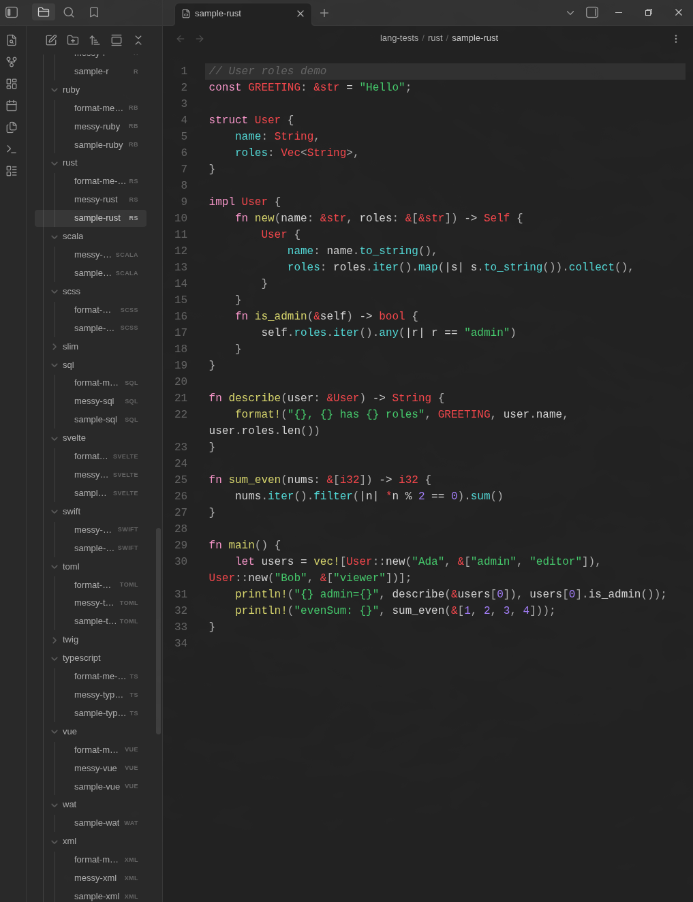
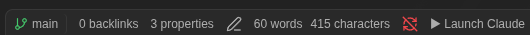
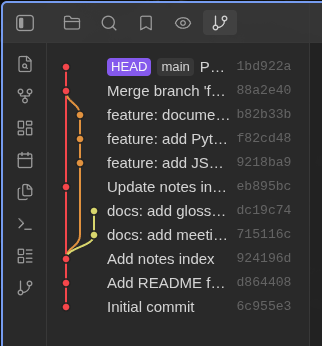
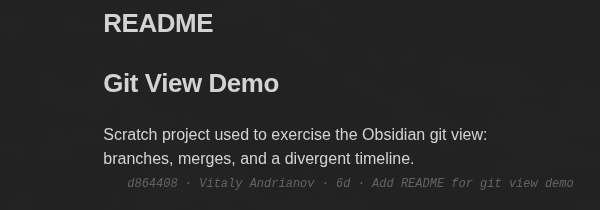
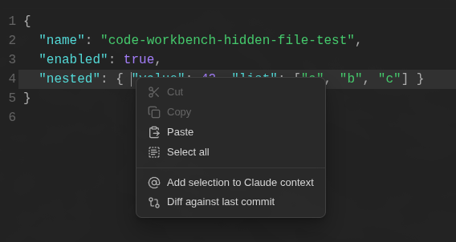
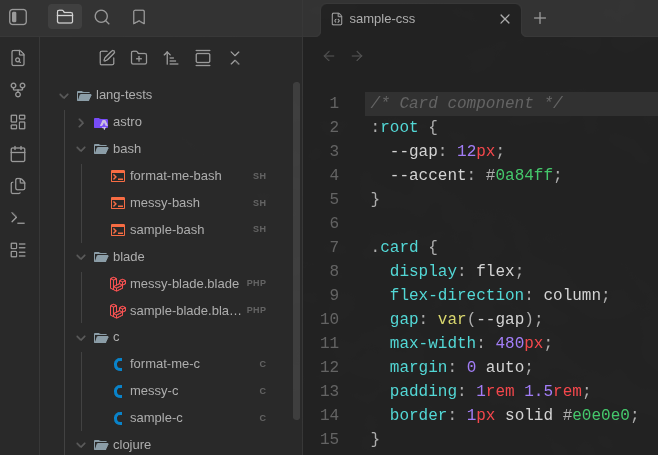
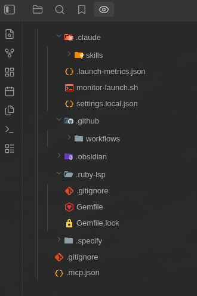
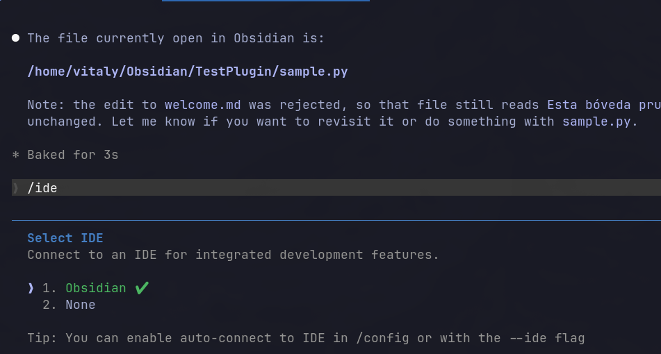
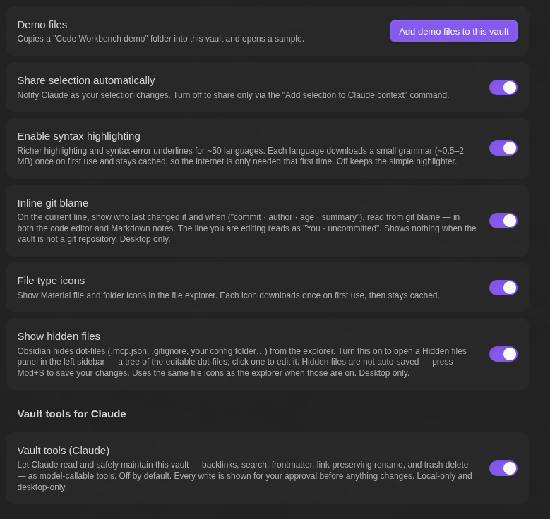

# Code Workbench for Obsidian

  

**I keep my whole life in Obsidian: notes, projects, research.** What I always wanted was help keeping it organized as it grows: filing new notes, fixing links, holding the system together. Code Workbench is what I built for that: a free plugin that gives Claude the tools to maintain the vault from inside Obsidian, plus a real code editor for everything else.

**One click to Claude.** The status bar opens a terminal in your vault with the [Claude Code](https://docs.claude.com/en/docs/claude-code) CLI already connected, with no `/ide` and no setup. It drives the CLI you already run, so it uses your Claude subscription instead of a metered API key: letting Claude work across a whole vault doesn't run up an API bill. It works with other Claude Code compatible models too, like Kimi K2 or DeepSeek.

**Let Claude maintain the vault.** Turn on the vault tools and Claude reads and edits notes through Obsidian itself. It answers from your own link graph (backlinks, wikilinks, frontmatter) and makes link-preserving changes: create, append, rename, delete to trash. Hand it your organizing system (PARA, Zettelkasten, or your own) and it files new notes where they belong, links them in, and holds the structure as the vault grows. Every change is shown for your approval first, so an AI tends the garden without quietly breaking your links. You don't have to write code for any of this; the knowledge-base side is for anyone who keeps notes in Obsidian.

**And a real code editor.** Obsidian only opens Markdown. Code Workbench opens and edits code and config files too (`.ts`, `.py`, `.rs`, `.json`, `.yaml`, even hidden dot-files) with syntax highlighting, inline diagnostics, and one-command formatting, saving back to disk. Select any text to send it to Claude as context. When Claude edits a file, the change lands as a side-by-side Keep/Reject diff you control, and a branch graph and inline blame show what it committed, without leaving Obsidian.

> Other Claude plugins for Obsidian give you a chat in a sidebar. This gives Claude tools to maintain the vault, and an editor to review what it does.

## What makes it different

- **Edit non-Markdown files.** Obsidian only edits Markdown. Code Workbench opens `.rs`, `.py`, `.ts`, `.go`, `.json`, `.yaml` and dozens more in an editable, highlighted view, and saves your changes back to the file.
- **Syntax highlighting** for about 50 languages via tree-sitter, colored to match your Obsidian theme.
- **Indentation guides.** Faint vertical lines mark each indentation level in the code editor and in diffs. On by default; toggle in settings.
- **Diagnostics:** syntax errors are underlined where they occur, for about 48 languages.
- **One-command formatting** for about 28 languages, including JSON, XML, YAML, TOML, JavaScript, TypeScript, Python, Go, Rust, Ruby, PHP, and C/C++.
- **Language-server intelligence (opt-in).** Turn it on and the editor connects to a language server you already have installed and adds real diagnostics, autocomplete, hover documentation, go-to-definition, and find-references — for Ruby, Python, Rust, Go, TypeScript, and about 30 more. It discovers servers and never installs them, and the same diagnostics reach Claude for an edit-verify-fix loop. A code outline panel lists the file's classes and methods from the same server, click to jump, and placing the cursor on a symbol highlights its other occurrences in the file. Off by default.
- **Accept or reject Claude's edits.** A proposed change opens as a side-by-side diff. Keep it or reject it, and edit the proposed side first if you want. Nothing is written until you keep it.
- **Works with any model.** It speaks the Claude Code CLI protocol, not a model API, so it runs with Claude, Kimi K2, DeepSeek, GLM, or any Anthropic-compatible endpoint you use through the CLI.
- **Launch Claude in one click.** Start the CLI in your vault from the status bar or settings; it opens your terminal in the right folder.
- **Vault tools for Claude.** Turn it on to let Claude read and maintain the vault through model-callable tools (backlinks, search, frontmatter, link-preserving rename, trash delete), with every write shown for your approval. See [Vault tools for Claude](#vault-tools-for-claude).

## Git review

Review what the AI committed without leaving Obsidian. The branch shows in the status bar, the history graph in a sidebar panel, and per-line blame in the editor.

**Branch in the status bar.** The current branch (or `no git`), with the icon colored by working-tree state: green when clean, yellow with uncommitted changes, orange on a detached HEAD.

**Branch graph.** A sidebar panel draws history as a branch graph: newest first, a lane per branch, merge and branch edges, ref labels. Click a commit to see the branches that contain it and the files it changed; click a file for a read-only side-by-side diff.

**Inline blame.** The current line shows its last commit, author, and age, read from `git blame`, in both code files and Markdown notes. On by default; toggle it in settings.

**Right-click actions.** Right-click a file — in the explorer, on a tab, or inside the editor — to run *Diff against last commit*: a read-only side-by-side diff of your working-tree changes against `HEAD`. In an editor the same menu also has *Add selection to Claude context*, which sends the current selection to Claude as an `@`-mention. Changed files are marked in the explorer too, VS Code style (`M` for modified, `U` for new), including dot-files in the *Hidden files* panel.

## In the file explorer

**File-type icons.** Material file and folder icons, fetched on demand and cached.

**Edit hidden files.** A *Hidden files* panel lists the dot-files Obsidian normally hides (`.mcp.json`, `.gitignore`, and the config folder) as a tree and opens them in the editor.

## Language support

Highlighting for 52 languages, diagnostics for 48, formatting for 28. Each grammar and formatter downloads the first time you open that language, then stays cached.

| Language | Highlighting | Diagnostics | Formatting |
|---|:---:|:---:|:---:|
| Astro | ✅ | ✅ | ✅ |
| Blade | ✅ | ✅ | — |
| C | ✅ | ✅ | ✅ |
| C# | ✅ | ✅ | — |
| C++ | ✅ | ✅ | ✅ |
| Clojure | ✅ | ✅ | — |
| CSS | ✅ | ✅ | ✅ |
| Dart | ✅ | ✅ | ✅ |
| Diff | ✅ | — | — |
| EJS | ✅ | ✅ | — |
| Elixir | ✅ | ✅ | — |
| ERB | ✅ | ✅ | — |
| ETLua | ✅ | ✅ | — |
| Gherkin | ✅ | ✅ | — |
| Go | ✅ | ✅ | ✅ |
| Haml | ✅ | ✅ | — |
| Handlebars | ✅ | ✅ | — |
| Haskell | ✅ | ✅ | — |
| HTML | ✅ | ✅ | ✅ |
| INI | ✅ | ✅ | — |
| Java | ✅ | ✅ | ✅ |
| JavaScript | ✅ | ✅ | ✅ |
| Jinja2 | ✅ | ✅ | ✅ |
| JSON | ✅ | ✅ | ✅ |
| Julia | ✅ | ✅ | — |
| Kotlin | ✅ | ✅ | — |
| Less | ✅ | — | ✅ |
| Liquid | ✅ | ✅ | — |
| Lua | ✅ | ✅ | ✅ |
| Objective-C | ✅ | ✅ | ✅ |
| Perl | ✅ | ✅ | — |
| PHP | ✅ | ✅ | ✅ |
| Pug | ✅ | ✅ | — |
| Python | ✅ | ✅ | ✅ |
| R | ✅ | ✅ | — |
| Ruby | ✅ | ✅ | ✅ |
| Rust | ✅ | ✅ | ✅ |
| Scala | ✅ | ✅ | — |
| SCSS | ✅ | — | ✅ |
| Shell | ✅ | ✅ | ✅ |
| Slim | ✅ | ✅ | — |
| SQL | ✅ | ✅ | ✅ |
| Svelte | ✅ | ✅ | ✅ |
| Swift | ✅ | ✅ | — |
| TOML | ✅ | ✅ | ✅ |
| Twig | ✅ | ✅ | — |
| TypeScript | ✅ | ✅ | ✅ |
| Vue | ✅ | ✅ | ✅ |
| WebAssembly (WAT) | ✅ | — | — |
| XML | ✅ | ✅ | ✅ |
| YAML | ✅ | ✅ | ✅ |
| Zig | ✅ | ✅ | ✅ |

A simple highlighter is always on. Turn on **Settings → Code Workbench → Enable syntax highlighting** for the richer tree-sitter highlighting and the diagnostics above.

For semantic help beyond syntax — real errors, autocomplete, hover, and navigation — turn on **Editor language intelligence** in settings. It uses a language server you already have installed (Ruby, Python, Rust, Go, and about 30 more), never installs one, and lists what it found so you can toggle each language.

## Using it

1. Open a code file in your vault. It opens in an editable, highlighted editor.
2. Turn on **Enable syntax highlighting** in the plugin settings for tree-sitter colors and error underlines.
3. To format, open the Command Palette (`Ctrl/Cmd+P`), type **Format code file**, and run it. You can assign a hotkey under **Settings → Hotkeys**.
4. Launch Claude: click **▶ Launch Claude** in the status bar (or **Run Claude in this vault** in the plugin settings). It opens a terminal in the vault and starts `claude`, already connected to Obsidian; the status bar shows `Claude ●`. Run `/ide` and pick **Obsidian** only if you start `claude` yourself in a separate terminal, or to reconnect after updating or reloading the plugin (the server restarts on a new port).
5. Share a selection: select text in a note, a code file, or a hidden file, then right-click → **Add selection to Claude context** (or run the same command from the palette) to send it as an `@`-mention. With **Share selection automatically** on, the current selection is sent as it changes.
6. Claude's edits open as a **Keep/Reject** diff you accept or reject.
7. Track changes: edited files are marked in the explorer (`M` modified, `U` new), and right-clicking any file gives **Diff against last commit** — a read-only diff of your working copy against `HEAD`. The branch shows in the status bar and full history in the git-graph panel.
8. Edit hidden files: turn on **Show hidden files** to get a panel of the dot-files Obsidian hides. Right-click a file there to open, make a copy, rename, delete to trash, show it in the system file manager, copy its path, or diff it.

## Try it

Once the plugin is installed, open **Settings → Code Workbench** and click **Add demo files to this vault**. It drops a `Code Workbench demo` folder of samples into your vault and opens one. Open a language folder:

- `sample-*` shows highlighting on a realistic snippet.
- `messy-*` shows error diagnostics (a red underline at the spot marked in a comment).
- `format-me-*` shows formatting: run **Format code file** and watch the layout fix itself.

## Install

1. Open **Settings → Community plugins → Browse** and search for **Code Workbench**.
2. Install it, then enable it. Desktop only.
3. Click **▶ Launch Claude** in the status bar. It opens a terminal in the vault and starts the Claude Code CLI, already connected, with no `/ide` step.

Step 3 needs the [Claude Code CLI](https://docs.claude.com/en/docs/claude-code) installed. Without it, the terminal still opens but shows a "command not found" error and stays open so you can read it. Install the CLI, then click Launch again.

## Sharing context with Claude

- **Automatic** (default): the plugin sends your current selection to Claude as it changes.
- **On demand:** Command Palette (`Ctrl/Cmd+P`) → **Add selection to Claude context** attaches the current selection as an `@`-mention (file path and line range).

Claude also reads the current selection, the open notes, and the workspace root through the connection.

## Vault tools for Claude

Turn on **Vault tools (Claude)** in settings to let Claude read and maintain this vault through model-callable tools, alongside the editor integration. Off by default, desktop only. The plugin runs a second local server (loopback HTTP, separate from the editor's WebSocket) and writes a project `.mcp.json` in the vault folder, so a `claude` session started there picks the tools up after a one-time approval. The settings panel also shows a manual `claude mcp add` command as a fallback.

Read tools use Obsidian's own link resolver and live cache, so they are accurate where `grep` is not: `getBacklinks`, `getOutgoingLinks`, `resolveWikilink`, `getFrontmatter`, `searchVault`, `listFilesInFolder`, `getDailyNote`, `getActiveNoteContent`. `searchVault` ranks notes by title, heading, tag, and frontmatter; full text inside note bodies stays with `ripgrep`, which `claude` already runs well.

Write tools go through the Obsidian vault API and are **shown for your approval before they apply**: `createNote`, `appendToNote`, `updateFrontmatter`, `renameNote` (updates every inbound `[[link]]`), and `deleteNote` (to trash, recoverable). There is no full-body overwrite tool; rewriting a note's contents stays on the editor's Keep/Reject diff.

Safety: the server binds to loopback only, requires a per-session bearer token (rejected even on loopback when missing or wrong), and checks the request origin. Writes are confined to the vault, run only through Obsidian, and never apply without your approval.

## How it works

The plugin runs a loopback WebSocket server and writes a discovery lock file to `~/.claude/ide/<port>.lock` (honoring `CLAUDE_CONFIG_DIR`). The CLI reads that file, connects with a per-session token, and speaks JSON-RPC 2.0 / MCP. On an accepted diff the plugin returns the approved content and the CLI performs the write, so there is a single writer and no race.

The optional vault-tools integration is a second, separate MCP server over loopback HTTP with its own per-session token. It runs only while **Vault tools (Claude)** is on, and its token store stays in the plugin's data folder, not in the editor's discovery directory.

## Everything is optional

The plugin forces nothing on you. Every feature is a toggle in **Settings → Code Workbench**: syntax highlighting, inline git blame, file icons, the hidden-files panel, automatic selection sharing, and the vault tools. Turn off anything you don't use. The vault tools, which give Claude read and write access to the vault, stay off until you switch them on.

## Privacy

No telemetry. Your code stays on your machine. The only network use is downloading language grammars and formatters once, on demand, from this project's GitHub releases. Turn off **Enable syntax highlighting** to avoid even that. The vault-tools server, when enabled, is loopback-only and token-authenticated; nothing it exposes leaves your machine.

## FAQ

### Claude Code already reads my vault. What does this add?

It does read it well: wikilinks, link updates, YAML, all of it. The plugin doesn't add comprehension. It adds three things the CLI alone doesn't:

- **A visual layer.** Every edit lands as a Keep/Reject diff before it touches the file, so you review instead of trusting it blind. Fix a line yourself in the highlighted editor without opening a separate IDE. Edit your `CLAUDE.md` or a skill file in the vault, including the ones under `.claude/` that Obsidian hides. Syntax highlighting and one-command formatting turn a raw JSON or XML blob into something you can read. Your eyes on the real file catch what grep misses.
- **Git review.** A branch indicator in the status bar, a branch-graph panel with click-to-diff, and inline `git blame` on the current line, so you see what changed, including what the AI just committed, without leaving Obsidian.
- **Graph queries at scale.** The vault tools let Claude query Obsidian's resolved link graph and metadata (backlinks, wikilink resolution, frontmatter) instead of grepping thousands of files. Grep over a big vault is slow and misses links the index already resolved.

Less "Claude can't read Obsidian", more "you see and steer what it does, and it queries the graph instead of guessing".

### Is this better than pointing an agent at my Obsidian folder?

A general agent pointed at the folder sees your notes as plain `.md` files. It doesn't use wikilinks, backlinks, or the graph, so it can break links when it moves or renames things. The plugin runs inside Obsidian and goes through Obsidian's link resolver, so a rename keeps every inbound `[[link]]` intact, and each change shows as a diff you keep or reject in context. It doesn't necessarily do more; it does it without wrecking your links and lets you approve each step.

### Does it manage git (commit, push, sync)?

No, and it doesn't need to. Ask Claude to stage, commit, or push through the CLI, or run git in the terminal yourself. The plugin only visualizes it: the branch, graph, and blame above.

## Support

Code Workbench is free. If it's useful to you, you can support it at a fraction of your Claude subscription. See [SUPPORT.md](https://github.com/vitaly-andr/obsidian-code-workbench/blob/main/SUPPORT.md) for ways to donate.

## Sponsorship

No sponsors yet. To sponsor development or place your logo here, get in touch:

- Telegram: [@VITALY_ANDR](https://t.me/VITALY_ANDR)
- Email: vitaly@andrianoff.online

## License

Source-available under the [PolyForm Shield License 1.0.0](https://github.com/vitaly-andr/obsidian-code-workbench/blob/main/LICENSE): free to use, study, and modify, but not to build a competing product. It is not an OSI "open source" license. Bundled third-party components keep their own licenses; see [THIRD-PARTY-LICENSES](https://github.com/vitaly-andr/obsidian-code-workbench/blob/main/THIRD-PARTY-LICENSES).
