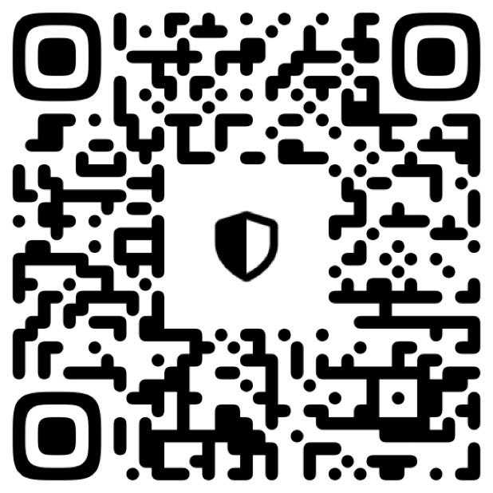
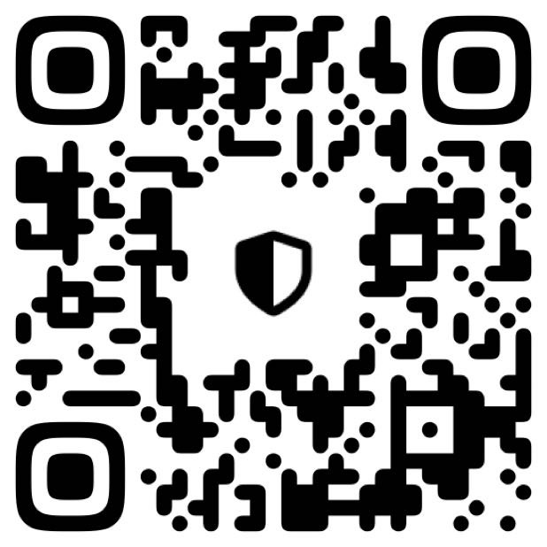
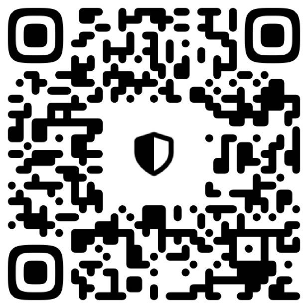

# Support

Code Workbench for Obsidian is free. If you find it useful, you can support it
at a fraction of your Claude subscription.

## Contact & sponsorship

Questions, feedback, or sponsorship? Reach me on Telegram ([@VITALY_ANDR](https://t.me/VITALY_ANDR))
or by email (vitaly@andrianoff.online).

## Tips (crypto)

**EVM — USDT / USDC / ETH** (send on Polygon, Base, BSC, or Arbitrum for low fees)

`0x3F0ce81a099D8e8dDbfADa0350a933fBA967b63F`

**USDT — TRON / TRC20** (lowest fees for stablecoins)

`TSmwsds6rj9LtiFdPrx6k7yan96B5VEt9x`

**Bitcoin**

`bc1qgh6hnuldrnvyjqrka3m0rfmznxjzmkkp8g9jrg`

